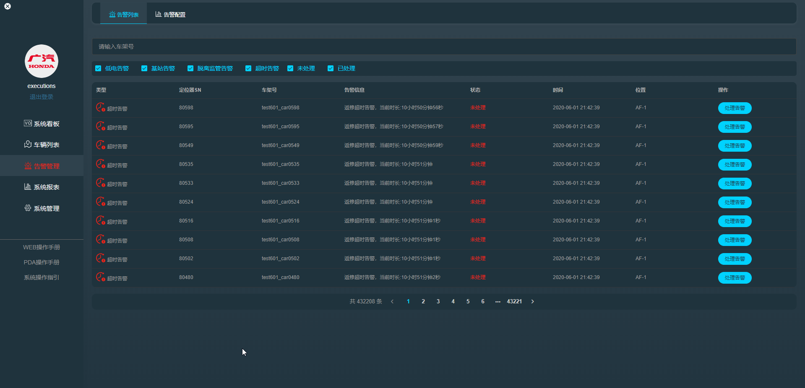
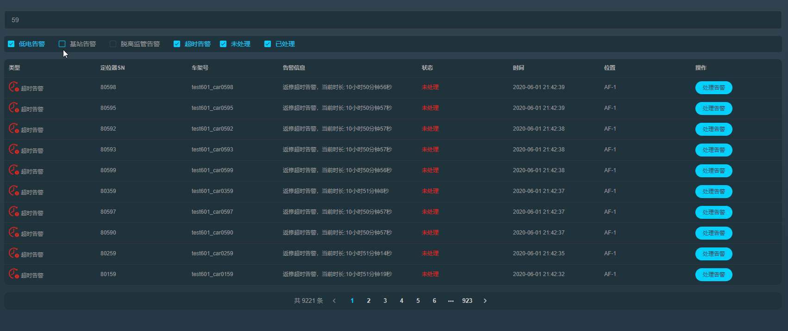
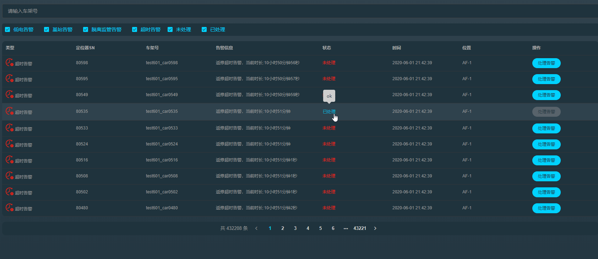
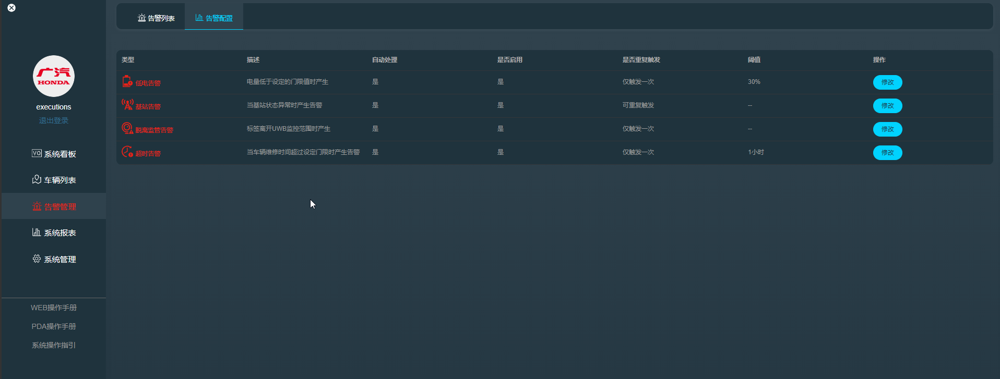

#### 告警列表

  > 告警列表可展示系统运行过程中所有的告警信息

  

  为方便用户查询某一辆或一类车产生的告警，用户可以按车架号模糊查找对应的车辆

  

  同时用户也可以按告警类型或是否已处理来查找告警

  

  **处理告警**
  用户可以通过点击右侧的处理告警按钮来输入处理记录信息来确认告警，同时某些告警类型会在系统检测到恢复正常的时候自动处理(用户可在告警配置中 关闭/启用 这个功能)

  

  已处理的告警会记录和显示处理时留下的记录信息

  

  

#### 告警配置

> 告警配置会定义不同的类型的告警将如何产生触发以及内容，用户可以按实际需求调整告警信息的基本配置

**告警类型**--系统共有四种不同类型的告警
- 1. 低电告警 - 当UWB标签电量低于设定的阈值时(可用户设定，默认10%)产生的告警
- 2. 基站告警 - 当检测到定位基站信号异常时产生
- 3. 脱离监管区域 - 当定位系统检测到车辆(绑定UWB标签)离开监管区域范围时产生告警
- 4. 超时告警 - 车场维修中的车辆维修时长超过一定时间(默认8小时，可由用户按实际情况配置)后产生

用户点击修改按钮会弹出模态框，用户可按实际需求对告警的基本配置做出调整

***