**维修列表**是记录当前车场维修车辆详细信息以及维修流程，位置状态信息以及对车场地图区域信息做出实时统计的页面，页面主要包含**地图车辆显示 | 车辆状态图表统计 | 在修车辆列表 | 未上传车辆列表 | 车辆详细信息及维修流程 | 地图区域切换及车辆数目统计 | 地图模式与列表模式切换**

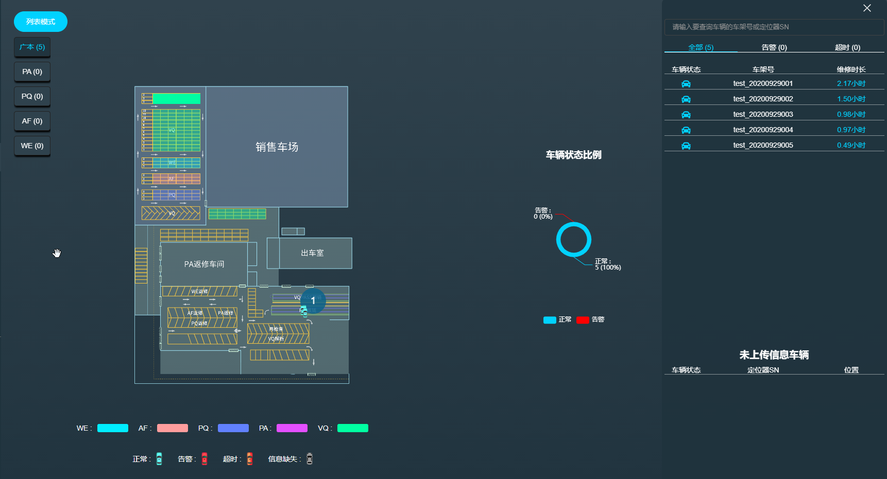

- 地图车辆显示
> 地图会实时显示当前车场所有在库车辆的位置和状态，鼠标点击车辆会显示车辆的简略信息，并且打开车辆详细信息和维修流程框

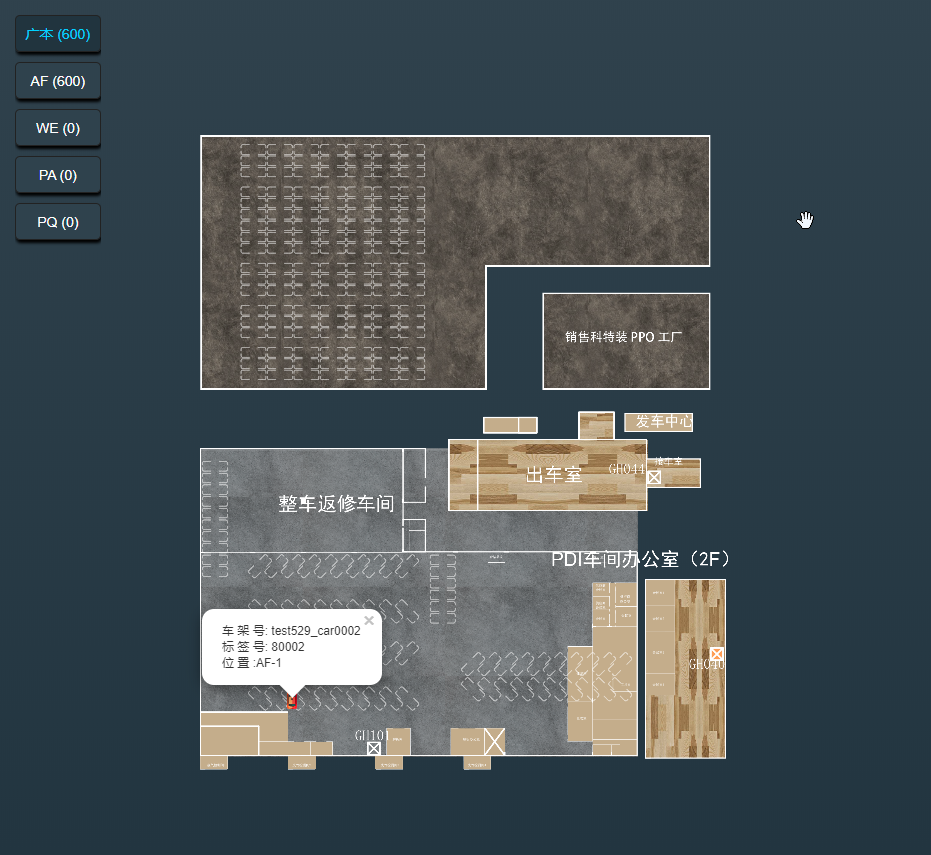

- 车辆状态图表统计
> 车辆状态图标会统计当前车场异常状态和正常状态车辆的数量和所占比例

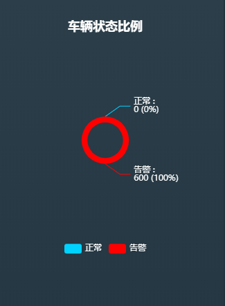

- 在修车辆列表
> 在修车辆列表会列出当前所有在库的维修车辆，同时会显示当前车辆的状态和已维修时长

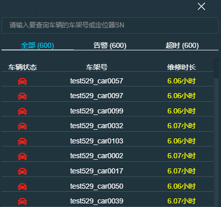

- 未上传信息车辆列表
> 未上传信息车辆列表为实际进入维修状态，但因网络等因素造成信息未及时上传而造成，在网络通畅上传信息后车辆状态会转变为当前车辆的实际状态

> 如果需要快速查找某一辆车或包含某一批次的车辆，可通过模糊搜索车辆车架号或绑定的定位器SN来快速查找

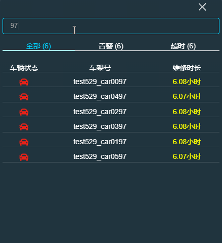

- 车辆详细信息及维修流程

> 点击维修车辆列表的某一项或者地图上的某一辆车，会弹出这辆车的详细信息和维修流程信息

> 将鼠标移动到维修过程的具体环节上会显示出该环节具体的开始和结束时间

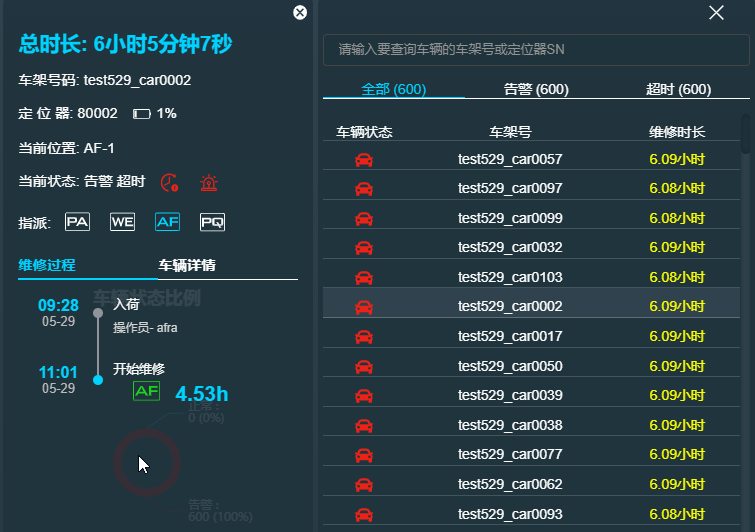

> 用户可以通过切换tab来切换显示的内容

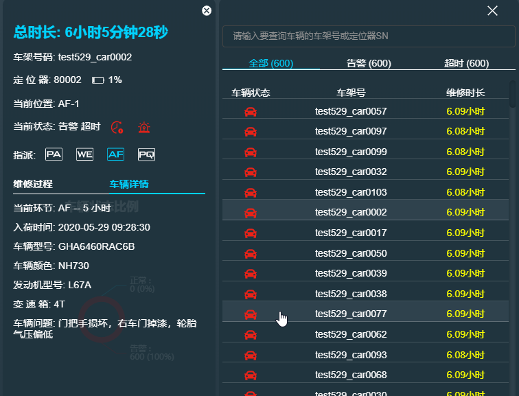

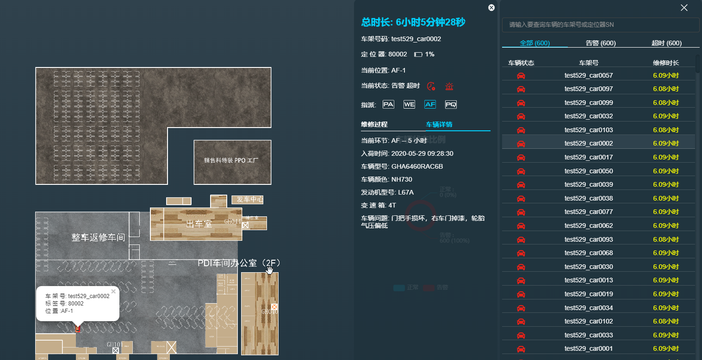

- 地图区域切换及车辆数目统计

> 页面地图左侧的区域列表会显示每个区域当前有多少辆车，点击每一个区域按钮时也会将地图切换到对应的区域

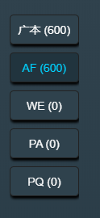

> 点击按钮可以切换地图到对应区域或者双击大地图的该区域也可i完成切换

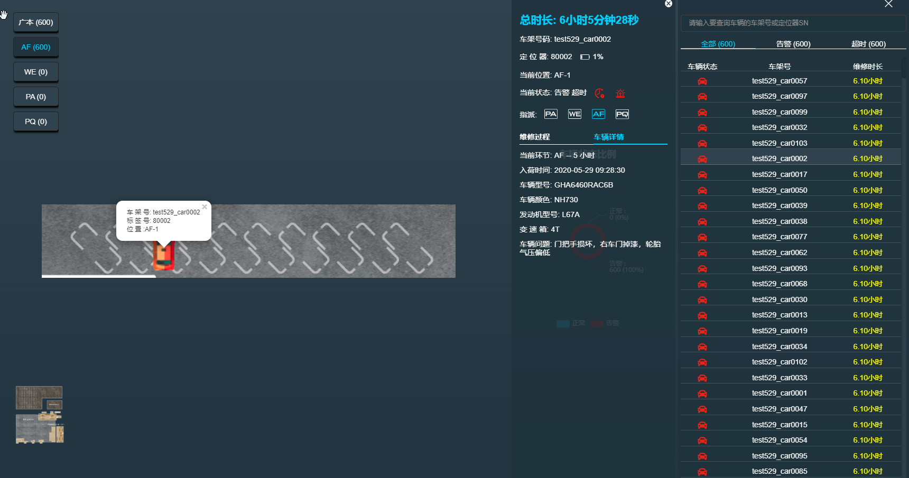

> 位于区域地图时会在页面左下方显示整体地图的缩小版，点击小地图可以切换回大区域地图

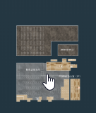

**地图模式及列表模式**

车辆列表页面默认分为 地图模式 和 列表模式，默认为地图模式，用户可以通过点击左上角对应按钮来切换

列表模式页面

> 列表模式会统计当前各流程环节的实时车辆数

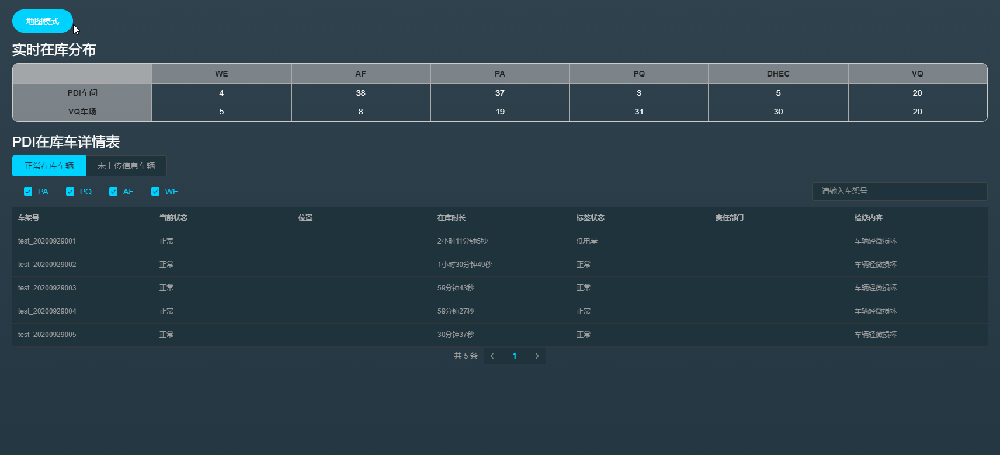

- PDI 在库详情

PDI在库详情表会列出当前所有车辆的基本信息

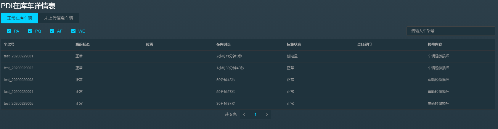

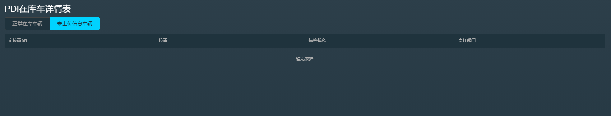

***