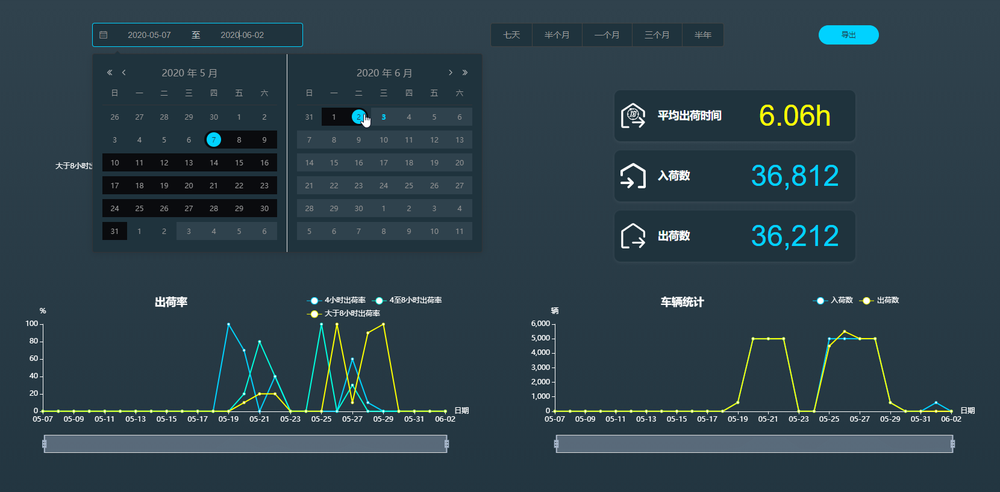
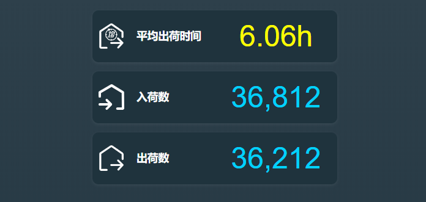
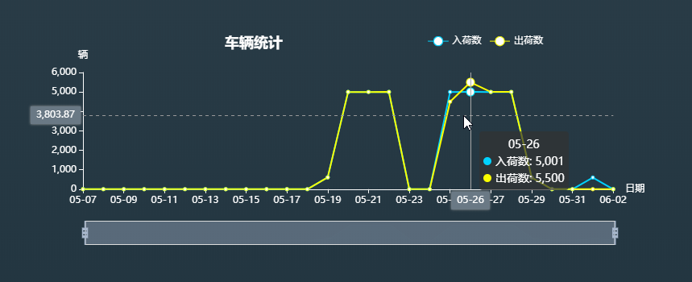
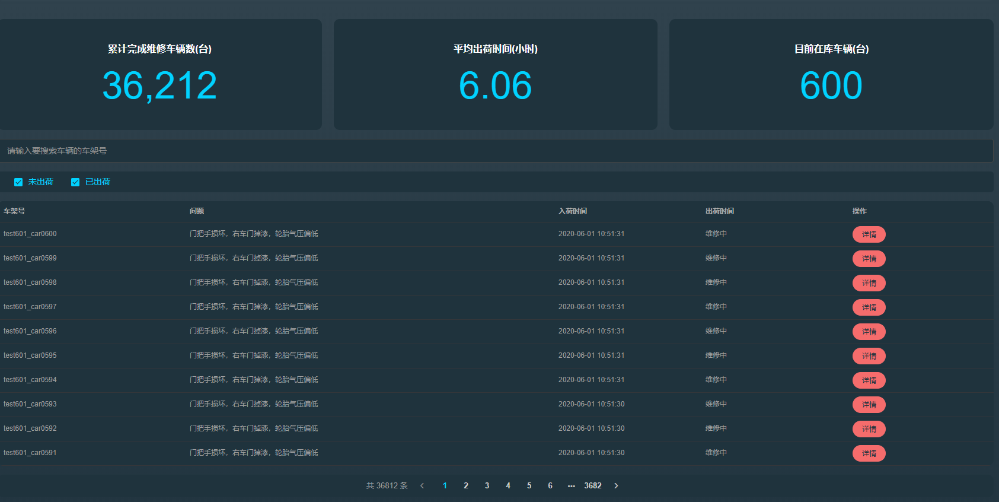
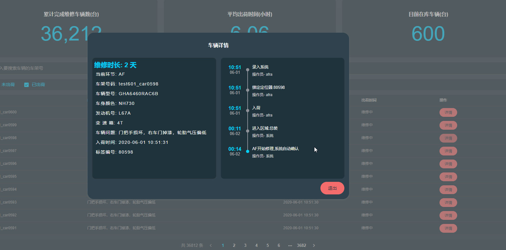

#### 报表统计

**报表统计页面会直观的显示一段时间内(由用户随时变换)维修车场的工作效率和工作量的统计**

页面上部分提供控件让用户可以快速自由的选择要查看统计的时间段

点击右侧的导出按钮会按用户选择的时间段将报表内容按Excel表格导出到本地

页面控件下方区域会按用户选择的时间段来计算显示报表数据

快速按预设时间选择查看数据

通过日历来自定义选择时间段

页面中间的饼形图标会显示所选时间内**四小时内出荷、四至八小时内出荷、大于八小时出荷**的比例

页面中间的列表会显示所选时间内的**总入荷数、出荷数、平均出荷时间**

**当选择的时间跨度太长时会影响图标的观看，用户可以在线性列表上滑动鼠标滚轮来缩放要显示时间段长度，也可以通过鼠标拖动下方的时间条来调整**

鼠标移动到图标上会显示某一天详细信息的统计信息

#### 车辆记录

车辆记录列表可以查询所有在修和已修车辆的详细信息和维修记录

点击详情可查看详细车辆信息和维修过程记录

***