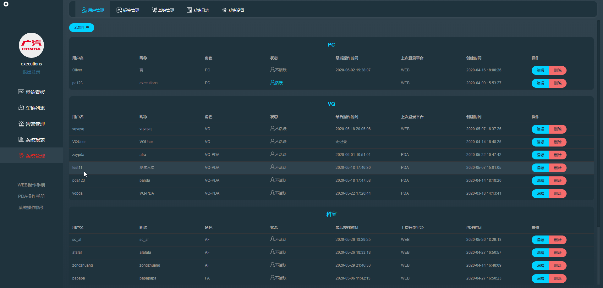
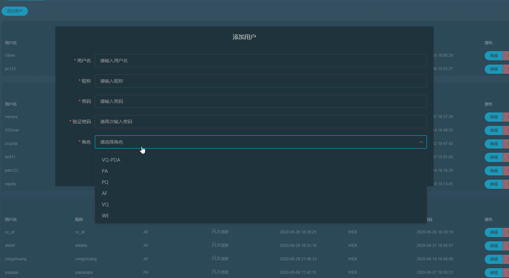
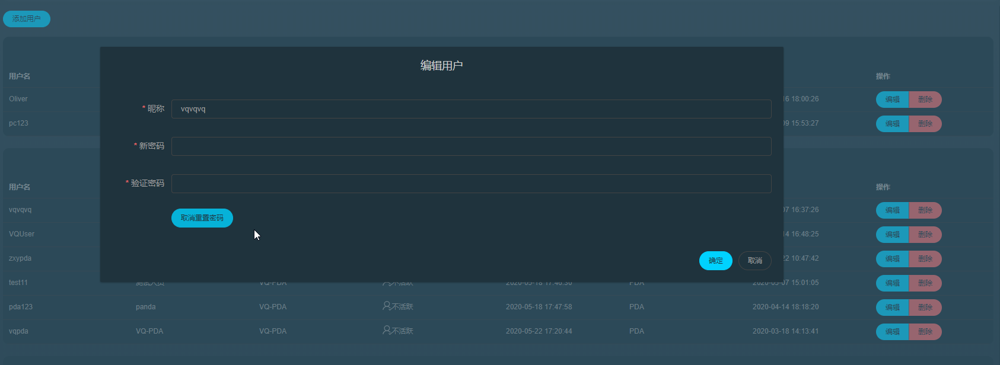
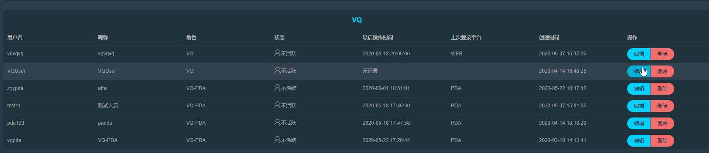

> 用户管理页面会展示当前登录角色平级及下级的所有工作人员，**当登录人员具有操作权限是可进行添加用户，修改或删除操作**，具体人员权限请参考人员类型。

用户点击添加用户按钮后会弹出添加用户的信息框，正确填入信息后(不同用户在创建人员时因权限不同可创建的人员类型也会不一致)，点击确定即可创建新人员！

用户点击编辑按钮后也会弹出编辑框，用户可以修改昵称和重置密码

当有权限时用户也可以删除人员

***