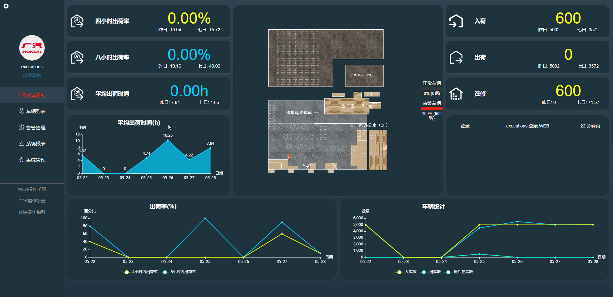
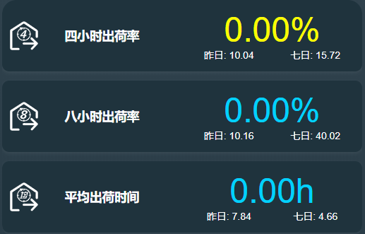
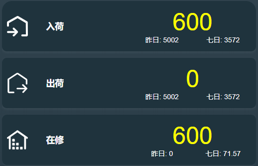
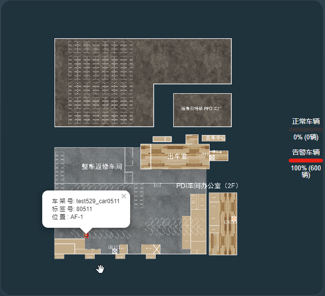
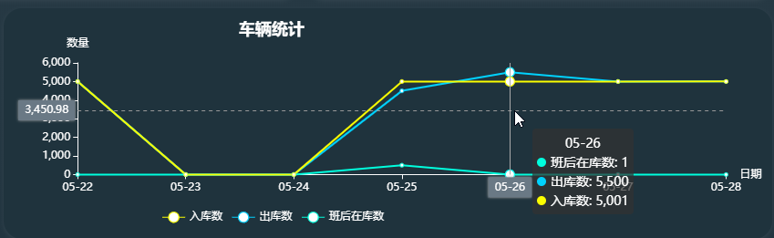

**系统看板**页面是实时反应当天车厂工作效率以及工作量量化统计以及对比的页面,页面左侧侧重显示当天及最近7天的工作效率对比，页面右侧侧重显示当天的工作量及最近7天的工作量对比

看板页面左侧上方会实时更新当天**4小时出荷率 | 八小时出荷率 | 平均出荷时间**，当今天的工作效率更高(数据优于昨天)，字体会以蓝色显示，反之会显示为黄色，可更直观的判断当天的工作成果

看板页面右侧上方会实时更新当天**入荷 | 出荷 | 在修**，当今天的工作量更大(数据优于昨天)，字体会以蓝色显示，反之会显示为黄色，可更直观的判断当天的工作成果

看板页面中间的车场地图会显示当前维修车厂车辆的实时地点分布以及数量比例恶的统计，点击车辆时会显示车辆的车架号，绑定的设备编号以及车辆当前的位置

图表会显示近期(7天)的工作效率和工作量对比，当鼠标移动到图表上时会显示更详细的提示

***
