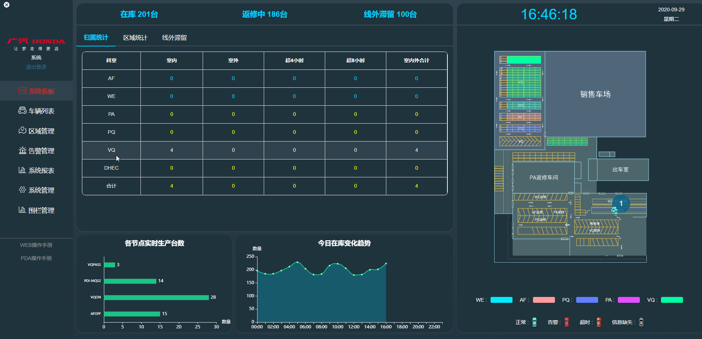
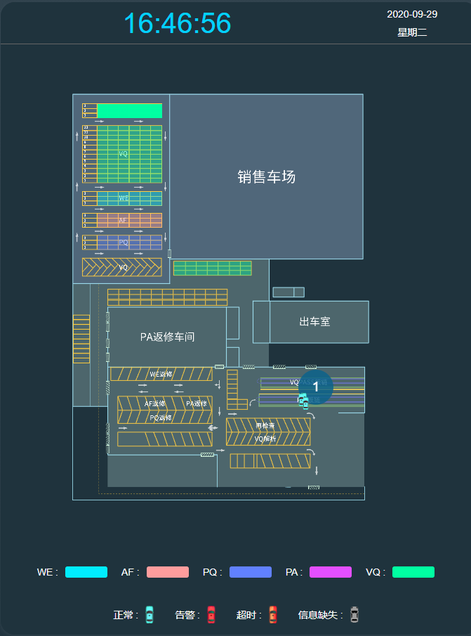
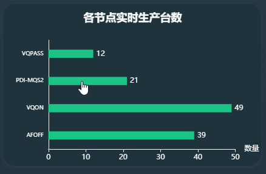
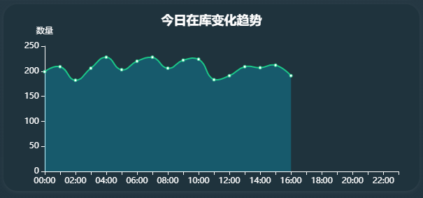
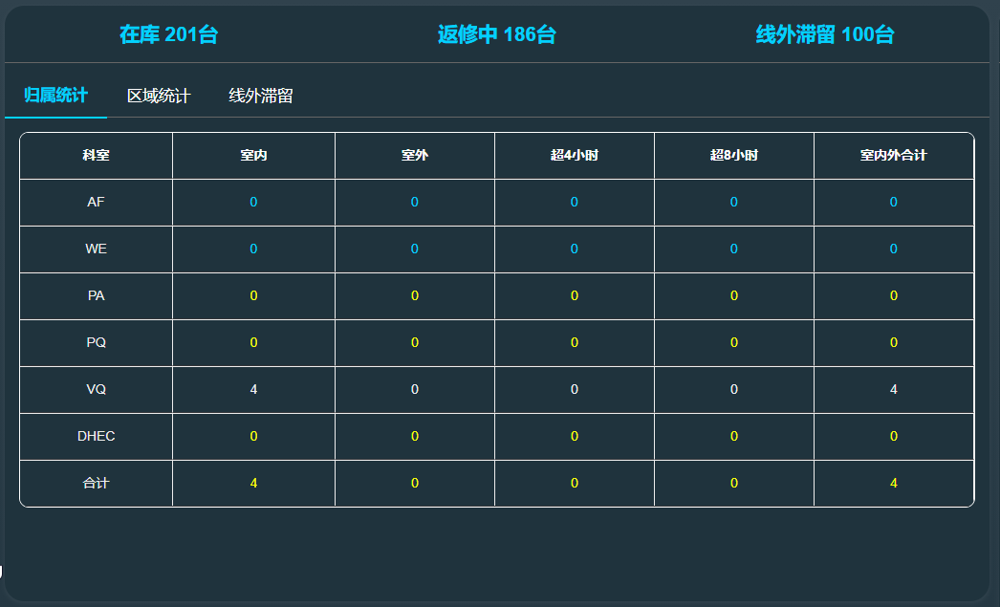
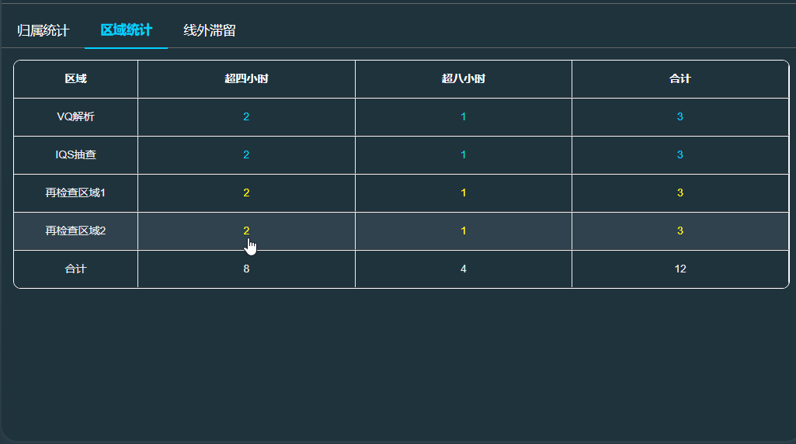
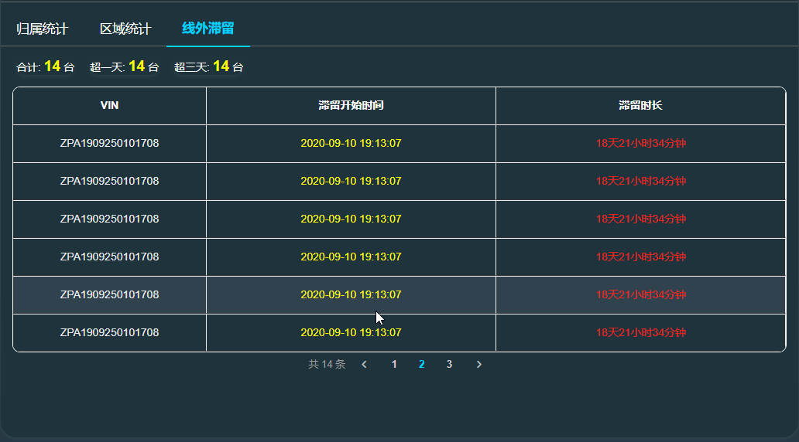
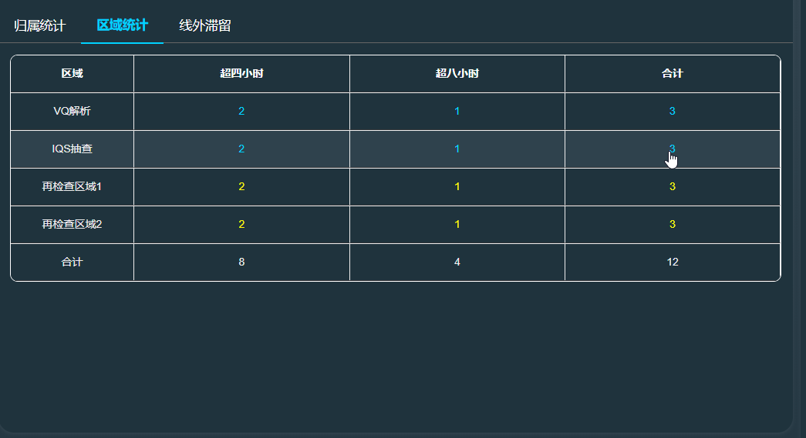
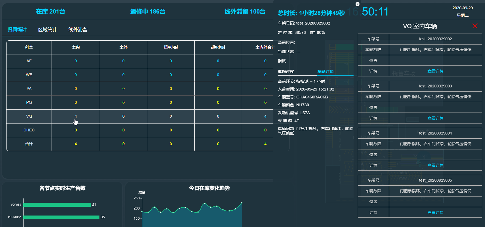

**系统看板**页面是实时反应当天车厂工作效率以及工作量量化统计以及对比的页面,页面左侧侧重显示当天的工作效率，页面右侧地图显示区域信息及车辆状态

看板页面右侧上方会实时更新当天实时的车辆位置及状态

看板页面左侧下方会实时更新当天**各节点**的车辆数量

看板页面左侧下方会按小时实时更新当天**在库趋势变化图**

看板页面左侧上方会实时更新当天**在库 | 返修中 | 线外滞留**的车辆数量

- 归属统计：归属统计会统计各科室的室内，室外，超4小时，超8小时的实时车辆数，点击每一个实时统计数字可以查看当前选择类型的车辆维修信息

- 区域统计：区域统计会统计各流程节点超4小时，超8小时的实时车辆数，点击每一个实时统计数字可以查看当前选择类型的车辆维修信息

- 线外滞留：展示线外滞留车辆的基本信息及滞留时长

> 点击统计的对应数字可以查看当前选择类型的车辆维修信息

> 点击查看详情可以查看该车辆的详细维修信息

- 点击右上角的 x 按钮可以关闭信息框

***
