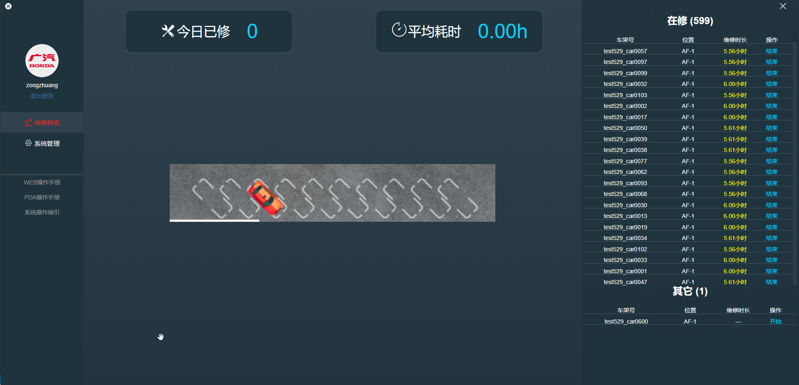

**科室维修列表**是记录当前科室维修车辆详细信息以及维修流程，位置状态信息以及对车场地图区域信息做出实时统计的页面，页面主要包含**地图车辆显示 | 在修待修车辆列表 | 车辆详细信息及确认 | 当日工作量及工作效率统计**

- 地图车辆显示
> 地图会实时显示当前科室所有在修和待修车辆的位置和状态，鼠标点击车辆会显示车辆的简略信息，并且打开车辆详细信息和进一步的操作提示

- 在修待修车辆列表
> 在修待修车辆列表会列出当前所有在库的维修车辆，同时会显示当前车辆的状态和已维修时长

- 当日工作量及工作效率统计
> 当日工作量及工作效率统计包含当前科室今日已修数量和平均维修一辆车的平均耗时

- 车辆详细信息及维修流程

> 点击在修车辆列表的某一项或者地图上的某一辆车，会弹出这辆车的详细信息和确认操作按钮(结束维修)

> 鼠标点击确认按钮按弹出确认框，填入确认信息(可以不填)，维修流程将进入下一阶段

> 点击待修车辆列表的某一项或者地图上的某一辆车，会弹出这辆车的详细信息和确认操作按钮(开始维修)

> 鼠标点击确认按钮按弹出确认框，点击确定按钮，车辆将进入该科室的在修列表中，车辆自动进入维修状态(若设置自动确认时间，超过确认时间时长，车流量自动进入开始维修状态)

***